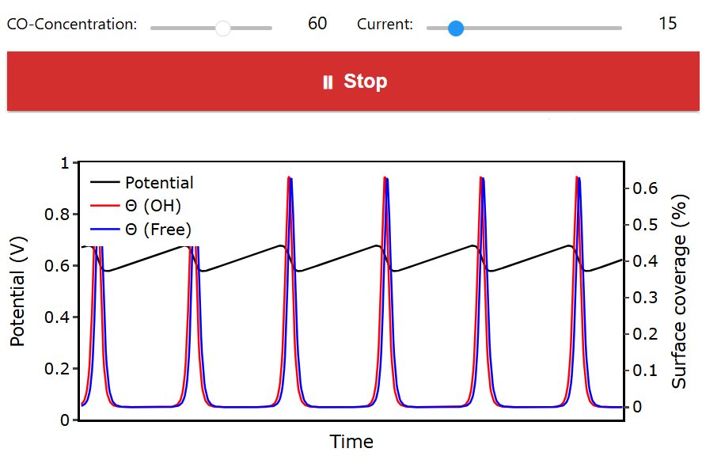

# HPLC-Deconvolution

A notebook for HPLC deconvolution and analysis.

## Example results
<p align="center">
  
</p>


## Installation

Requires Python 3.8+ and the packages listed in `requirements.txt`.

Install dependencies:

```bash
python -m pip install --upgrade pip
pip install -r requirements.txt
```

Run the notebook locally:

```bash
# start Jupyter and open `HPLC.ipynb`
jupyter notebook HPLC.ipynb
```

## Citation

If you use this software, please cite it as follows:

> Ketter, F., & Palkovits, R. (2026). HPLC-Deconvolution (Version 0.1.0). Zenodo. DOI will be added upon release

Also see the `CITATION.cff` file for machine-readable citation metadata.
