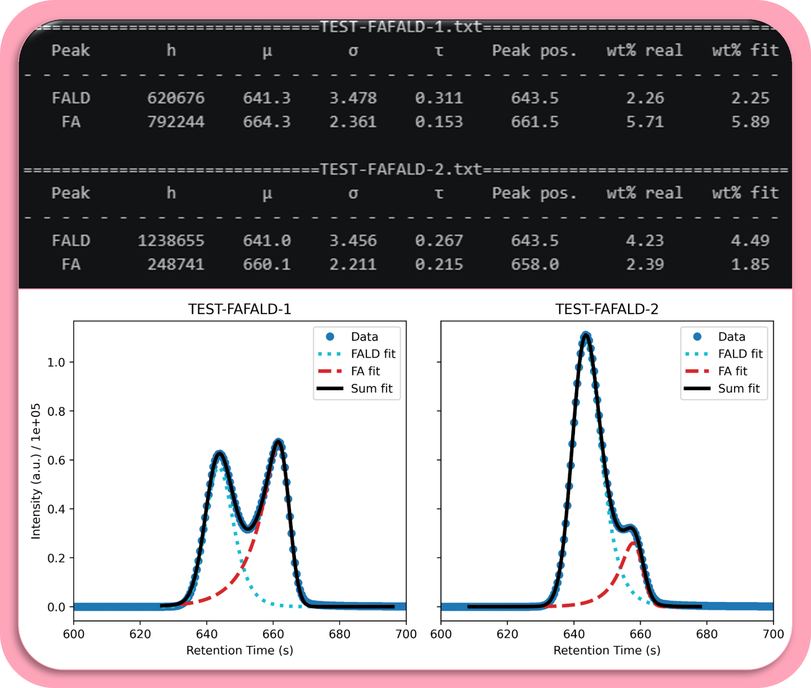

# HPLC-Deconvolution

Deconvolution and quantification of HPLC chromatograms using exponentially modified Gaussian (EMG) peak fitting.

<p align="center">
  
</p>

## Overview

This package provides tools for the quantitative analysis of HPLC data, with a focus on resolving co-eluting or asymmetric peaks. It implements exponentially modified Gaussian (EMG) functions and their mirrored variants to model tailing and fronting peak shapes, respectively. A constrained EMG approach is used where peak shape parameters (σ and τ) are modeled as linear functions of the peak area, reducing the number of free parameters and improving fit robustness.

The workflow was developed for the quantification of **formaldehyde** (tailing peaks, EMG fit) and **formic acid** (fronting peaks, mirrored EMG fit) in reaction mixtures, but the fitting functions are generic and can be applied to any HPLC dataset.

## Features

- **Peak fitting models:** Gaussian, pseudo-Voigt, exponentially modified Gaussian (EMG), mirrored EMG (for fronting peaks), and sums thereof
- **Constrained EMG fitting:** Models where σ and/or τ scale linearly with peak area *h*, reducing free parameters and regularizing the fit
- **Calibration workflow:** Linear calibration (forced through origin) using external standards with R² evaluation
- **Chromatogram extraction:** Reads LabSolutions-exported `.txt` chromatogram files
- **R² calculation:** Generic coefficient-of-determination function for any callable model

## Fitting functions

The core fitting models are implemented in `fit_functions.py`:

| Function | Description |
|---|---|
| `gaussian()` | Standard Gaussian (normal) distribution |
| `two_gaussians()` | Sum of two Gaussian functions |
| `pseudo_voigt()` | Linear combination of Gaussian and Lorentzian |
| `two_pseudo_voigts()` | Sum of two pseudo-Voigt functions |
| `EMG()` | Exponentially modified Gaussian — models **tailing** peaks |
| `EMG_mirrored()` | Mirrored EMG — models **fronting** peaks |
| `EMGs_tail_front()` | Sum of EMG + mirrored EMG for asymmetric peaks |
| `make_constrained_EMG()` | EMG where σ and τ are linear functions of *h* |
| `make_sigma_constrained_EMG()` | EMG where only σ is a linear function of *h*; τ is free |

All constrained model variants also have mirrored and combined (tail + front) counterparts.

## Project structure

```
HPLC-Deconvolution/
├── fit_functions.py      # Peak fitting functions (EMG, Gaussian, pseudo-Voigt, etc.)
├── HPLC.ipynb            # Jupyter notebook with full calibration and analysis workflow
├── requirements.txt      # Python dependencies
├── LICENSE               # License file
├── CITATION.cff          # Machine-readable citation metadata
├── README.md             # This file
├── data/                 # Example HPLC data files (LabSolutions .txt format)
│   ├── CAL-FA-*.txt          # Formic acid calibration standards
│   ├── CAL-FALD-*.txt        # Formaldehyde calibration standards
│   ├── TEST-FAFALD-*.txt     # Test mixture samples
│   └── EXP-DATA.txt          # Experimental data
└── figures/              # Output figures
```

## Requirements

- Python 3.8+
- Dependencies listed in `requirements.txt`:
  - `numpy`
  - `scipy`
  - `matplotlib`
  - `jupyter`

## Installation

```bash
python -m pip install --upgrade pip
pip install -r requirements.txt
```

## Usage

### Interactive notebook

Launch the Jupyter notebook to run the full workflow:

```bash
jupyter notebook HPLC.ipynb
```

The notebook guides you through:

1. **Calibration** — Loading calibration standards, fitting peaks with EMG/mirrored EMG, and constructing linear calibration curves (peak area vs. concentration).
2. **Peak shape analysis** — Determining the linear relationships between peak area (*h*) and the EMG shape parameters σ and τ.
3. **Constrained fitting** — Applying the constrained EMG models to experimental data for robust quantification with fewer free parameters.

### Programmatic use

The fitting functions can be imported directly for standalone use:

```python
import numpy as np
from fit_functions import EMG, EMG_mirrored, r_squared
from scipy.optimize import curve_fit

# Load chromatogram data
x = np.array([...])  # retention time (s)
y = np.array([...])  # detector intensity (a.u.)

# Fit a tailing peak with an exponentially modified Gaussian
popt, pcov = curve_fit(EMG, x, y, p0=[1e5, 640, 3.0, 0.3])
h, mu, sigma, tau = popt

# Evaluate fit quality
r2 = r_squared(lambda x: EMG(x, *popt), x, y)
```

### Constrained EMG example

If you have determined from calibration that σ = *a*·*h* + *b* and τ = *c*·*h* + *d*:

```python
from fit_functions import make_constrained_EMG

tau_coeffs = (c, d)   # (slope, intercept) for tau vs. h
sig_coeffs = (a, b)   # (slope, intercept) for sigma vs. h
constrained_EMG = make_constrained_EMG(tau_coeffs, sig_coeffs)

# Now h and mu are the only free fitting parameters
popt, _ = curve_fit(lambda x, h, mu: constrained_EMG(x, h, mu), x, y)
```

## Data format

The `extract_chromatogram()` function in the notebook reads LabSolutions-exported `.txt` files. These files contain chromatogram data under a `[LC Chromatogram(Detector B-Ch1)]` header. The time axis is converted from minutes to seconds automatically.

## Citation

If you use this software in academic work, please cite it as:

> Ketter, F., & Palkovits, R. (2026). HPLC-Deconvolution (Version 1.0.0). Zenodo. DOI will be added upon release

A machine-readable `CITATION.cff` file is also included in the repository.

## License

This project is licensed under the terms specified in the `LICENSE` file.